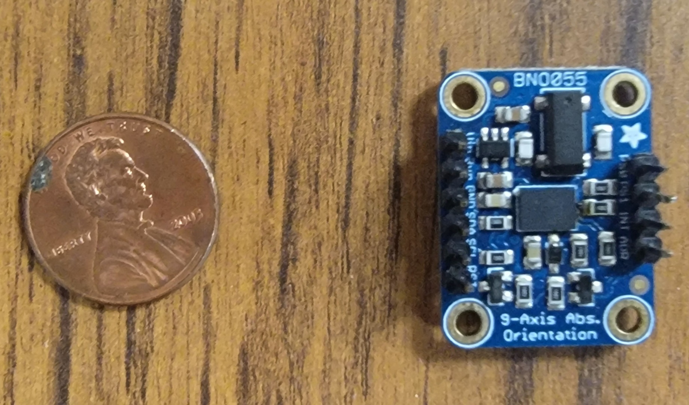

#### Abstract
The goal of this application is to test the use of 3D Reconstruction on Robotic Perception to manipulate deformable objects. 

#### Installation Instructions

First install .

Next, perform the below comands in a bash terminal. 

```bash
# Clone the RMDLO 3D Reconstruction Playground
$ git clone git@github.com:RMDLO/3DReconstruction_Playground.git --recurse-submodules
# Install 3D Reconstruction Playground requirements
$ cd 3DReconstruction_Playground && pip install -r requirements.txt
```

#### Run Instructions

First perform the following commands for image capture

```
# Run getImageTest.py
$ cd 3DReconstruction_Playground/src
$ python getImageTest.py
```

Next, to run a reconstruction, perform the following commands on the directory of images you created
```
# Run opensfm_run_all
./3DReconstruction_Playground/src/OpenSfM/bin/opensfm_run_all ./3DReconstruction_Playground/src/OpenSfM/data/[Image_file_name]
```

To see your point cloud using vedo, run the following command

```
# vedo ./3DReconstruction_Playground/src/OpenSfM/data/[Image_file_name]/undistorted/depthmaps/merged.ply
```
#### Example Output

3D Reconstruction Playground allows users to reconstruct scenes with small objects where depth imagery may not have fine enough resolution or may be impossible to collect. Below is an example image of a small component we used 3D Reconstruction Playground to image.

<p align="center">
  
</p>

Below is the pointcloud generated from 3D Reconstruction Playground. This pointcloud was generated using 

<p align="center">
  
</p>

#### Acknowledgements

Reconstruction algorithm from [OpenSfM Git Repository](https://github.com/mapillary/OpenSfM)

Realsense image stream based on [Intel Realsense Documentation](https://dev.intelrealsense.com/docs/python2) and The [Librealsense Git Repository](https://github.com/IntelRealSense/librealsense).


